**Отчёт SLAM**

- [**1. Постановка задачи и обоснование разработки**](#1-постановка-задачи-и-обоснование-разработки)
  - [**1.1. Цель работы**](#11-цель-работы)
  - [**1.2. Формулировка задачи**](#12-формулировка-задачи)
  - [**1.3. Технические требования**](#13-технические-требования)
  - [**1.4. Необходимость собственной разработки**](#14-необходимость-собственной-разработки)
- [**2. Аналитический обзор**](#2-аналитический-обзор)
  - [**2.1. Классификация SLAM-систем**](#21-классификация-slam-систем)
  - [**2.2. Обзор классических реализаций**](#22-обзор-классических-реализаций)
  - [**2.3. Современные нейросетевые подходы**](#23-современные-нейросетевые-подходы)
  - [**2.4. Обоснование выбора архитектуры**](#24-обоснование-выбора-архитектуры)
- [**3. Общая архитектура разрабатываемой SLAM-системы**](#3-общая-архитектура-разрабатываемой-slam-системы)
  - [**3.1. Функциональная схема**](#31-функциональная-схема)
  - [**3.2. Разрабатываемые модули**](#32-разрабатываемые-модули)
- [**3.3. Математическая модель преобразований**](#33-математическая-модель-преобразований)
- [**4. Модуль инициализации**](#4-модуль-инициализации)
  - [**4.1. Назначение и требования**](#41-назначение-и-требования)
  - [**4.2. Алгоритм инициализации**](#42-алгоритм-инициализации)
  - [**4.2.1. Методы извлечения и сопоставления признаков**](#421-методы-извлечения-и-сопоставления-признаков)
  - [**4.2.2. Вычисление фундаментальной матрицы и основной матрицы**](#422-вычисление-фундаментальной-матрицы-и-основной-матрицы)
  - [**4.2.3. Восстановление матриц вращения и переноса**](#423-восстановление-матриц-вращения-и-переноса)
  - [**4.2.4. Триангуляция нормализованных точек**](#424-триангуляция-нормализованных-точек)
  - [**4.2.5. Фильтрация по параллаксу и геометрической состоятельности**](#425-фильтрация-по-параллаксу-и-геометрической-состоятельности)
- [**4.3. Оптимизация на этапе инициализации**](#43-оптимизация-на-этапе-инициализации)
- [**5. Модуль мониторинга кадров (трекинга)**](#5-модуль-мониторинга-кадров-трекинга)
  - [**5.1. Обнаружение и сопоставление признаков**](#51-обнаружение-и-сопоставление-признаков)
  - [**5.2. Оценка позиции текущего кадра**](#52-оценка-позиции-текущего-кадра)
  - [**5.3. Обновление видимости карты**](#53-обновление-видимости-карты)
- [**6. Ключевые кадры**](#6-ключевые-кадры)
  - [**6.1. Критерии вставки нового ключевого кадра**](#61-критерии-вставки-нового-ключевого-кадра)
  - [**6.2. Структура ключевого кадра**](#62-структура-ключевого-кадра)
- [**7. Оптимизация**](#7-оптимизация)
  - [**7.1. Локальная оптимизация**](#71-локальная-оптимизация)
  - [**7.2. Глобальная оптимизация**](#72-глобальная-оптимизация)
  - [**7.3. Сравнение с классическими методами оптимизации**](#73-сравнение-с-классическими-методами-оптимизации)
- [**8. Проведение эксперимента**](#8-проведение-эксперимента)
  - [**8.1. Условия эксперимента**](#81-условия-эксперимента)
  - [**8.2. Выводы**](#82-выводы)
- [**9. Перспективы развития системы**](#9-перспективы-развития-системы)
- [**10. Заключение**](#10-заключение)
- [**Используемые источники**](#используемые-источники)

# **1. Постановка задачи и обоснование разработки**

## **1.1. Цель работы**

Целью выполняемой работы является создание программного модуля, обеспечивающего решение задачи визуальной одометрии и картографирования среды на основе данных монокулярной видеокамеры. Разрабатываемая система предназначена для функционирования на мобильных вычислительных платформах и ориентирована, в первую очередь, на применение в составе бортовых систем беспилотных летательных аппаратов, что накладывает определённые ограничения на вычислительные ресурсы, энергопотребление и архитектуру программного обеспечения. При этом заложенные принципы построения системы сохраняют универсальный характер и допускают использование в иных сценариях мобильной робототехники.

Разрабатываемый модуль должен обеспечивать непрерывную оценку параметров перемещения камеры относительно окружающего пространства с одновременным восстановлением трёхмерной структуры наблюдаемой сцены. Предполагается, что система функционирует в режиме, приближенном к реальному времени, и формирует пространственное представление среды в виде облака точек и локальной трёхмерной карты, пригодной для последующего использования в навигационных и управляющих алгоритмах.

Реализация поставленной цели предполагает построение полного вычислительного контура, включающего обработку видеопотока, извлечение устойчивых визуальных признаков, восстановление трёхмерных координат наблюдаемых точек, накопление карты и коррекцию траектории движения камеры за счёт оптимизационных процедур. Получаемые результаты должны обладать достаточной точностью и вычислительной эффективностью, чтобы обеспечить корректную работу системы в условиях ограниченных аппаратных ресурсов, характерных для бортовых вычислительных систем БПЛА.

## **1.2. Формулировка задачи**

Задача заключается в создании комплексной программной системы, способной на основе последовательности изображений, поступающих от монокулярной камеры, выполнять оценку траектории движения наблюдателя и восстанавливать геометрическую структуру окружающей среды. В рамках данной работы рассматривается задача одновременной локализации и картографирования, предполагающая совместное решение двух взаимосвязанных подзадач — определения текущей позы камеры и построения пространственной карты сцены.

Система должна функционировать в непрерывном режиме, обрабатывая видеопоток в порядке поступления кадров и обеспечивая устойчивое накопление пространственной информации при одновременном уточнении траектории движения. При этом предполагается, что система эксплуатируется на подвижной платформе, в том числе на беспилотном летательном аппарате, что требует устойчивой работы при динамичных изменениях сцены, возможных вибрациях и ограниченных временных ресурсах обработки.

Основой функционирования системы является выделение информативных визуальных признаков в каждом кадре и установление соответствий между ними в последовательных наблюдениях. На основе найденных соответствий выполняется оценка относительной позы камеры, выраженной в виде пространственного преобразования между кадрами. Полученная информация используется для триангуляции наблюдаемых точек, что позволяет восстановить их трёхмерные координаты и сформировать начальное облако точек, служащее основой локальной карты.

Дальнейшая обработка предполагает последовательное расширение и уточнение карты за счёт добавления новых точек и ключевых кадров, а также оптимизацию параметров структуры и траектории. Оптимизационные процедуры должны обеспечивать устойчивость системы к накоплению ошибок и корректное поведение на длительных временных интервалах, что особенно важно при эксплуатации на автономных мобильных платформах.

## **1.3. Технические требования**

Разрабатываемая система должна функционировать в условиях ограниченной сенсорной конфигурации и минимальных аппаратных предпосылок. Основным источником информации является стандартная видеокамера, работающая в монохроматическом или RGB-режиме, без использования специализированных датчиков глубины. Такой подход соответствует типичной конфигурации бортового оборудования беспилотных летательных аппаратов малого и среднего класса.

Система должна обеспечивать вычисление параметров траектории и структуры карты в режиме, приближенном к реальному времени. Это означает, что суммарные вычислительные затраты на обработку одного видеокадра, обновление карты и выполнение оптимизационных процедур не должны приводить к существенным задержкам, способным нарушить устойчивость восприятия и навигации. Допускается работа в квазиреальном времени, при условии сохранения согласованности между траекторией и картой.

Архитектура программного модуля должна быть ориентирована на работу на вычислительных платформах с ограниченными ресурсами, характерных для бортовых систем БПЛА, и при этом оставаться модульной и расширяемой. Это предполагает возможность последующего добавления поддержки более сложных сенсорных конфигураций, таких как стереокамеры, RGB-D датчики или инерциальные измерительные модули, без принципиального изменения базовой структуры системы.

## **1.4. Необходимость собственной разработки**

Необходимость создания собственной SLAM-системы определяется ограничениями и сложностью существующих решений, а также потребностью в архитектуре, допускающей глубокую модификацию и исследовательскую гибкость. Распространённые реализации визуального SLAM, такие как ORB-SLAM [1], DSO [2] или LSD-SLAM [3], обладают высокой точностью и широким признанием в научном сообществе, однако их интеграция в исследовательские проекты требует значительных усилий. Эти системы основаны на сложных C++ фреймворках, включающих обширные зависимости и требующих многоэтапной компиляции. Подобная структура существенно усложняет процесс адаптации, встраивания новых алгоритмических блоков и проведения экспериментов, связанных с заменой или модификацией отдельных компонент пайплайна.

Дополнительным препятствием является глубоко инкапсулированная архитектура большинства зрелых систем. Несмотря на открытый исходный код, внутренняя организация таких пакетов ориентирована на производительность, а не на исследовательское удобство. Это приводит к тому, что вмешательство в логику исполнения кода, модули оптимизации или структуру графа поз требует значительного времени и глубокого понимания кода, что затрудняет быстрые итерации и экспериментирование с новыми методами. В результате применение существующих решений в роли платформы для исследований оказывается малоэффективным.

# **2. Аналитический обзор**

## **2.1. Классификация SLAM-систем**

Современные SLAM-системы можно разделить на несколько крупных классов, различающихся по способу обработки визуальной информации и по тому, какие признаки сцены используются для оценки перемещения и реконструкции геометрической структуры: косвенные, прямые.

Косвенные методы опираются на предварительное извлечение дискретных визуальных признаков, обладающих инвариантностью к изменению масштаба, освещённости и перспективы. Такие системы формируют разреженное представление сцены, где ключевыми элементами являются устойчивые точки, линии или иные локальные геометрические структуры. Алгоритм сопоставляет эти элементы между кадрами и использует их для восстановления относительного перемещения камеры. Подход отличается высокой интерпретируемостью и устойчивостью при наличии текстурированных областей, однако демонстрирует снижение эффективности при работе с однородными или слаботекстурными поверхностями [4 - 6].

Прямые методы отказываются от использования дискретных признаков и работают непосредственно с интенсивностью пикселей. В основе таких алгоритмов лежит предположение о фотометрической согласованности соседних изображений. Метод минимизирует ошибку между значениями яркости соответствующих точек, что позволяет использовать значительно большее количество информации, чем в косвенных подходах. Прямые методы обеспечивают хорошие результаты в условиях малоконтрастных сцен, однако требуют строгого соблюдения модели фотометрической стабильности, что делает их чувствительными к изменениям освещённости и экспозиции [2, 3, 7].

Гибридные методы объединяют преимущества обоих классов, сочетая использование ключевых точек с обработкой плотных или полуплотных областей изображения. Такой подход повышает устойчивость к разнообразным условиям съёмки и позволяет компенсировать недостатки отдельных методов. В гибридных системах могут применяться различные уровни детализации при обработке изображения, а также дополнительные критерии согласованности для повышения точности оценки движения и структуры [1, 8].

Отдельным направлением развития являются нейросетевые (end-to-end) модели, в которых весь процесс SLAM реализуется в виде единой обучаемой архитектуры. Такие системы используют глубокие сверточные или рекуррентные сети для оценки относительного перемещения, восстановлении глубины и построения карты в интегрированной форме. В отличие от классических методов, они не требуют явного выделения признаков или ручного определения функционала ошибки, поскольку обучаются на больших объемах данных и способны самостоятельно формировать внутреннюю репрезентацию структуры сцены. Несмотря на высокую гибкость и способность работать в сложных условиях, полностью обучаемые системы обладают значительной вычислительной стоимостью и демонстрируют ограниченную интерпретируемость, что затрудняет их применение в задачах, требующих строгой предсказуемости поведения [9 - 11].

## **2.2. Обзор классических реализаций**

Классические реализации визуального SLAM представляют собой зрелые системы, в которых закрепились методологические подходы, определившие развитие области на протяжении последнего десятилетия. Они стали базовыми эталонными решениями, на основе которых формируются новые алгоритмы и проводится сравнение различных методов. Несмотря на различия в архитектуре и применяемых вычислительных моделях, все эти системы стремятся к решению одной и той же фундаментальной задачи: восстановлению траектории движения камеры и построению карты наблюдаемой сцены с высокой степенью точности и устойчивости.

Одним из наиболее известных и широко используемых решений является семейство ORB-SLAM, включающее версии ORB-SLAM, ORB-SLAM2 и ORB-SLAM3. Эти системы основаны на разреженном представлении сцены и использовании дескрипторов ORB в качестве ключевых признаков. Архитектура ORB-SLAM включает три основные параллельные нити: трекинг, локальное картографирование и обнаружение замыкания петель [1]. Вторая версия расширяет систему поддержкой стереокамер [8] и RGB-D сенсоров, а третья добавляет возможность совместной обработки данных IMU, переходя к визуально-инерциальной одометрии [12]. Это делает ORB-SLAM3 одной из наиболее универсальных и точных классических реализаций. Основным ограничением является высокая чувствительность к условиям наблюдения, а также значительная сложность кода, затрудняющая адаптацию алгоритма под исследовательские нужды.

RTAB-Map представляет собой ориентированную на практическое применение систему, использующую методы построения графов поз и обнаружения повторных наблюдений на основе визуально-ориентированных словарей признаков. Её ключевой особенностью является акцент на масштабируемости и возможности работы с большими пространствами, включая робототехнические платформы в помещениях и на открытой местности [13]. RTAB-Map изначально проектировался для интеграции с ROS и активно использует облака точек, что делает его гибким инструментом для робототехнических приложений. При этом он менее компактен и имеет более высокие вычислительные требования по сравнению с системами, ориентированными исключительно на визуальную одометрию.

LSD-SLAM относится к прямым методам и использует полуплотное представление сцены, опираясь на интенсивности пикселей вместо дискретных ключевых точек. Эта система обеспечивает реконструкцию плотных карт глубины для каждого ключевого кадра и объединение таких карт в глобальное представление [3]. LSD-SLAM демонстрирует устойчивость при работе со слаботекстурированными областями, где методы опирающиеся на признаки нередко теряют стабильность. Однако прямой подход предъявляет повышенные требования к фотометрической стабильности и калибровке камеры, что ограничивает его применение в условиях изменяющегося освещения.

DSO также является прямым методом, но использует выборку наиболее информативных пикселей, что позволяет снизить вычислительные затраты по сравнению с полуплотными методами. В основе подхода лежит минимизация фотометрической ошибки, обеспечивающая точное восстановление относительного движения камеры и структуры сцены [2]. DSO демонстрирует высокую точность и устойчивость благодаря тщательному выбору активных точек и эффективной стратегии оптимизации. Однако отсутствие явного построения карты и ограниченные возможности по восстановлению глобальной структуры сцены делают DSO близким по функциональному назначению к высокоточному модулю визуальной одометрии, но не к полноценной SLAM-системе.

## **2.3. Современные нейросетевые подходы**

Развитие методов глубинного обучения привело к формированию нового класса SLAM-систем, в которых ключевые этапы обработки заменяются или дополняются обучаемыми моделями. Эти решения используют сверточные, рекуррентные и трансформерные архитектуры, что позволяет отказаться от ручного подбора признаков, упростить обработку сложных визуальных сцен и обеспечить устойчивость к изменениям освещённости, текстуры и динамики. В отличие от классических методов, где каждый этап реализуется в виде отдельного алгоритмического блока, современные нейросетевые подходы стремятся к созданию более унифицированных и согласованных моделей трекинга и реконструкции.

Одним из наиболее известных представителей этого направления является DROID-SLAM, объединяющий оценку движения и построение карты в единую рекуррентную структуру [10]. Архитектура использует плотное сопоставление кадров и итеративный механизм уточнения позы, основанный на оптимизационных обновлениях, выполняемых прямо внутри сети. Это позволяет одновременно учитывать информацию от большого числа изображений, формируя высокоточную траекторию и плотную карту глубины. DROID-SLAM демонстрирует устойчивость к сценам с малым количеством текстур и сохраняет точность при значительных изменениях точки наблюдения.

Другим направлением развития являются архитектуры, построенные на основе RAFT — модели плотного оптического потока [14]. В системах класса RAFT используется идея вычисления плотных соответствий между кадрами с последующим восстановлением структуры сцены. Подобный подход обеспечивает сопоставление даже в условиях сложного движения и деформаций, что трудно достижимо средствами классических методов. Применение плотных соответствий позволяет отказаться от разреженных наборов точек и перейти к более информативному представлению сцены, однако такие методы требуют значительных вычислительных ресурсов и зависят от аппаратного ускорения.

DeepFactors относится к более обобщенным моделям, в которых используется обучаемое представление геометрии сцены и параметров движения [11]. Концепция таких систем основана на формировании внутреннего латентного пространства, которое описывает геометрию и динамику окружающей среды. При этом оптимизация выполняется непосредственно в этом скрытом пространстве, что обеспечивает гибкость и способность моделировать сложные структуры. Основной принцип заключается в том, что карта и движение представляются через параметризованные обученные функции, а не через традиционные наборы точек и ключевых кадров. Это позволяет достигать высокой плотности карты и интегрировать большое количество наблюдений.

Отдельного внимания заслуживает класс гибридных компонентов, таких как SuperPoint, SuperGlue и MiDaS [15 - 17], которые не являются полноценными SLAM-системами, но широко применяются внутри них. SuperPoint реализует нейросетевой детектор и дескриптор признаков, обеспечивая устойчивость при недостатке текстур и значительных изменениях перспективы. SuperGlue использует механизм внимания для сопоставления признаков между изображениями, что существенно повышает качество соответствий и снижает количество ложных совпадений. MiDaS обеспечивает оценку глубины по одиночному изображению и позволяет получать относительные карты расстояний даже при отсутствии стереоданных. Интеграция подобных нейросетевых компонентов в традиционные SLAM-системы делает возможным создание гибридных решений, сочетающих преимущества классических алгоритмов и современных методов глубокого обучения.

Современные обучаемые методы вносят качественно новые возможности в визуальный SLAM, однако их применение связано с рядом ограничений, включая высокую вычислительную стоимость, необходимость наличия GPU и сложность интерпретации внутренних механизмов. Тем не менее они формируют новое направление исследований, предлагая альтернативу классическим системам и открывая путь к созданию полностью дифференцируемых и обучаемых SLAM-архитектур.

## **2.4. Обоснование выбора архитектуры**

В условиях ограниченной сенсорной конфигурации, где единственным источником информации является монокулярная камера, наиболее рациональным является использование классической архитектуры, основанной на выделении и сопоставлении разреженных визуальных признаков. Все операции — от детектирования признаков до триангуляции и оптимизации поз — могут быть строго описаны в терминах проектной геометрии, что облегчает анализ устойчивости, диагностику ошибок и проведение модификаций. В отличие от полностью обучаемых систем, где внутренняя структура является скрытой и не всегда поддается анализу, классический подход предоставляет полный контроль над вычислительным процессом.

Кроме того, разреженные методы демонстрируют устойчивость при обработке моно-данных, тогда как прямые и обучаемые подходы нередко оказываются чувствительными к изменениям фотометрических условий. Для монокамеры характерны неоднозначности масштаба и повышенные требования к геометрической согласованности наблюдений, что делает такой подход предпочтительным. Использование устойчивых признаков позволяет компенсировать недостаток информации, характерный для моно-сенсоров, и формировать карту, основанную на надежных наблюдениях.

Дополнительным аргументом является возможность интеграции тензорных оптимизаторов. Применение PyTorch в качестве вычислительного ядра открывает доступ к дифференцируемым моделям, автоматическому вычислению градиентов и гибким схемам оптимизации. Такой подход позволяет развивать систему в сторону гибридных решений, в которых классические методы построения карты сочетаются с обучаемыми компонентами и современными архитектурами. Наличие тензорной основы делает возможной дальнейшую адаптацию алгоритмов под параллельные вычисления и расширение в сторону более сложных моделей, не нарушая базовую структуру архитектуры.

# **3. Общая архитектура разрабатываемой SLAM-системы**

## **3.1. Функциональная схема**

Функциональная схема разрабатываемой SLAM-системы представляет собой последовательность взаимосвязанных вычислительных этапов, обеспечивающих обработку видеопотока, восстановление траектории движения камеры и построение трехмерного представления окружающей среды. Каждый этап имеет собственные алгоритмические задачи и формирует данные, необходимые для дальнейших модулей системы. Логическая структура контура соответствует общепринятой архитектуре визуального SLAM, однако было принято решение в качестве инструмента оптимизации использовать тензорные вычисления (Pytorch) [18]. Данное решение обусловлено простотой интеграции, однако накладывает ряд ограничений связанных с вычислительной мощностью и дополнительными затратами на аппаратные ресурсы.

Работа системы начинается с получения изображения от камеры. На этом этапе обеспечивается захват кадров в виде последовательного потока данных, который должен сохранять временную согласованность и корректность параметров съёмки. Затем изображение подвергается предобработке, включая коррекцию дисторсии и возможное преобразование к градациям серого.

Далее выполняется извлечение локальных признаков, обладающих устойчивостью к изменению масштаба, угла наблюдения и освещения. На основе выделенных признаков для текущего кадра выполняется сопоставление с признаками из предыдущих ключевых или обычных кадров. Система сравнивает дескрипторы и формирует пары соответствующих точек, служащих основой для последующего восстановления относительного движения камеры. На основе установленных соответствий оценивается относительная поза камеры. Это достигается путем решения геометрической задачи восстановления преобразования между двумя наблюдениями.

После вычисления позы выполняется реконструкция новых трехмерных точек путем триангуляции наблюдений. Формируются пространственные координаты тех элементов сцены, которые наблюдаются из различных положений камеры и удовлетворяют геометрическим требованиям корректности. Эти точки включаются в локальную карту, которая постепенно уточняется и расширяется в процессе движения камеры.

По мере накопления информации система формирует ключевые кадры. Они представляют собой опорные состояния, фиксирующие положение камеры и набор наблюдаемых точек. Ключевые кадры служат основой для локальной оптимизации, в ходе которой уточняются параметры поз и пространственная структура карты.

Далее система поддерживает локальную карту, включая обновление положений точек, удаление выбросов и интеграцию новых элементов среды. На последующих этапах выполняется обнаружение ситуаций, когда камера повторно оказывается в ранее наблюдаемой области, инициализируется процесс замыкания петель. Выявление петли приводит к перераспределению ошибок накопления и корректировке глобальной топологии карты.

Завершающей стадией является глобальная оптимизация. Она выполняет согласование всех поз ключевых кадров и соответствующих точек на основе имеющихся ограничений, включая наблюдения, реконструкции и замыкания петель. В результате формируется согласованная глобальная геометрическая структура, обеспечивающая целостное представление сцены и корректную траекторию движения камеры на всем интервале работы системы.

## **3.2. Разрабатываемые модули**

Архитектура разрабатываемой SLAM-системы построена как набор специализированных модулей, каждый из которых отвечает за отдельный этап обработки данных и взаимодействует с другими компонентами через чётко определённые интерфейсы.

Началом вычислительного контура является модуль инициализации. Он выполняет ключевую задачу - формирования первого устойчивого состояния системы путём восстановления начальной относительной позы камеры и триангуляции первичных трёхмерных точек. Инициализатор создаёт начальную карту и формирует первые ключевые кадровые привязки, от которых зависит дальнейшая стабильность и точность всего SLAM-процесса. Одной из его важнейших функций является проверка геометрической согласованности восстановленной структуры и корректная нормализация масштаба.

Следующим крупным блоком является основная логика трекинга (процесс отслеживания поступающих кадров). Этот модуль отвечает за обработку входного видеопотока, выделение визуальных признаков, установление соответствий между кадрами и оценку относительной позы текущего кадра. В состав модуля входит детектор и дескриптор признаков, блок сопоставления, а также алгоритмы вычисления преобразования между наблюдениями, включая решение задачи PnP [19]. Модуль трекинга обеспечивает непрерывное определение положения камеры относительно локальной карты и формирует данные, необходимые для последующей реконструкции новых точек.

Далее модуль оптимизации. Этот модуль играет центральную роль в снижении накопленных погрешностей и обеспечении согласованности структуры карты. В нём реализуются локальные и глобальные процедуры оптимизации поз и трёхмерных точек, основанные на минимизации ошибок репроекции. Поскольку система использует тензорные вычисления, оптимизация выполняется в дифференцируемой форме, что является и сильным преимуществом так и недостатком.

Управление картой представляет собой отдельный модуль, включающий обработку и обновление набора пространственных точек и ключевых кадров. В этом блоке осуществляется добавление новых элементов, обновление уже существующих, фильтрация шумовых данных и поддержание связности топологии карты. Подмодуль отвечает за поддержание информационной структуры карты в актуальном состоянии и корректную интеграцию новых наблюдений.

Процесс замыкания петель реализован как самостоятельный функциональный компонент. Его задача заключается в выявлении повторных посещений ранее наблюдавшихся областей и обращении к механизмам исправления накопленных ошибок. После обнаружения петли модуль формирует дополнительные ограничивающие связи между ключевыми кадрами и инициирует глобальную оптимизацию, направленную на выравнивание всей структуры карты.

Завершает архитектурную схему модуль визуализации. Он обеспечивает представление текущего состояния карты, траектории камеры и диагностической информации в наглядной форме. Для визуализации применяются библиотеки Matplotlib, Plotly и Open3D, поскольку они легко интегрируются в программный код, поддерживают трёхмерные представления облаков точек и позволяют оперативно анализировать результаты работы системы на различных этапах обработки. Визуализатор используется как в исследовательских целях, так и при разработке и отладке алгоритмов, обеспечивая контроль качества функционирования всех модулей [20 - 22].

Ниже представлена аккуратно оформленная таблица, отражающая структуру подмодулей и их функциональные назначения. Формат выдержан в строгом научно-техническом стиле.

**Таблица 1 — Функциональные подмодули**

| Подмодуль                    | Основное назначение                                                                                                                                                     |
| ---------------------------- | ----------------------------------------------------------------------------------------------------------------------------------------------------------------------- |
| **Инициализатор**            | Формирование начального состояния системы, восстановление первичной позы камеры, триангуляция стартовых 3D-точек и создание начальной карты.                            |
| **Основная логика трекинга** | Обработка видеопотока, выделение признаков, сопоставление ключевых точек и вычисление относительного преобразования между кадрами, включая решение задачи PnP.          |
| **Модуль оптимизации**       | Уточнение поз и структуры карты посредством минимизации ошибок репроекции; выполнение локальной и глобальной оптимизации на основе тензорных вычислений.                |
| **Модуль обработки карты**   | Управление набором трёхмерных точек и ключевых кадров, обновление и фильтрация данных, поддержание топологической связности локальной карты.                            |
| **Модуль замыкания петель**  | Выявление повторных посещений уже наблюдавшихся областей, формирование дополнительных ограничений в графе поз и инициирование глобальной корректировки структуры карты. |
| **Визуализатор**             | Представление карты, траектории и диагностических данных в наглядной форме, обеспечивающей контроль качества работы системы и проведение отладки.                       |

# **3.3. Математическая модель преобразований**

Описание движения камеры в SLAM основано на том, что каждая её поза представляет собой жёсткое преобразование, включающее вращение и перенос в трёхмерном пространстве [23, 24]. Такое преобразование принадлежит группе $SE(3)$ и записывается в однородной форме как
$$
T =
\begin{pmatrix}
R & t \
0 & 1
\end{pmatrix},
$$
где $R \in SO(3)$ — матрица вращения, определяющая ориентацию камеры, а $t \in \mathbb{R}^3$ — вектор переноса, задающий её положение в мировой системе координат. Эта матрица служит базовым оператором перемещения между координатными системами.

Поскольку вращение является элементом группы $SO(3)$, оно должно удовлетворять условиям ортогональности
$$
R^\top R = I, \qquad \det(R)=1 ,
$$
где $I$ — единичная матрица. Эти свойства гарантируют, что преобразование не искажает геометрическую структуру пространства, что важно при последующем переносе точек.

Используя матрицу $R$ и вектор $t$, преобразование точки из координат камеры в мировые координаты задаётся выражением
$$
X_w = R X_c + t ,
$$
где $X_c$ — координаты точки в системе камеры, а $X_w$ — координаты той же точки в мировой системе. Именно эта формула лежит в основе процедуры триангуляции, обновления трёхмерной карты и вычисления относительного положения камеры между кадрами.

Чтобы связать геометрию пространства с наблюдениями на изображении, преобразованная точка $X_w$ сначала снова выражается в координатах камеры, а затем проектируется на плоскость изображения. Проекционная операция имеет вид
$$
x = K,\pi(R X + t),
$$
где $x$ — пиксельные координаты наблюдаемой точки, $K$ — матрица калибровки камеры, а функция $\pi(\cdot)$ выполняет перспективную нормализацию. Она преобразует трёхмерную точку в координатах камеры $X_c = (X_c^x, X_c^y, X_c^z)$ в нормализованную форму
$$
\pi(X_c) =
\begin{pmatrix}
X_c^x / X_c^z \
X_c^y / X_c^z \
1
\end{pmatrix},
$$
что соответствует идеализированной модели камера - пиноль. Таким образом, $R$ и $t$ определяют положение точки в пространстве, а $K$ задаёт отображение нормализованных координат в пиксельную сетку.

Матрица внутренних параметров камеры имеет вид
$$
K =
\begin{pmatrix}
f_x & 0   & c_x \
0   & f_y & c_y \
0   & 0   & 1
\end{pmatrix},
$$
где $f_x$ и $f_y$ задают масштаб проекции по горизонтали и вертикали, а $c_x$ и $c_y$ определяют положение главной точки. Эта матрица завершает цепочку преобразований «трёхмерная точка → изображение».

Когда система строит карту и оценивает движение камеры, она сравнивает предсказанную через модель проекций точку с её фактическим наблюдением на изображении. Это сравнение выражается через функцию ошибки репроекции
$$
e = x_{\text{набл}} - K,\pi(R X + t),
$$
где $x_{\text{набл}}$ — фактически измеренная координата точки в изображении, а $K,\pi(R X + t)$ — её предсказанное положение, вычисленное на основе текущей оценки позы камеры. Именно минимизация этой ошибки связывает все приведённые выше выражения в единый оптимизационный процесс, обеспечивающий корректное восстановление структуры карты и траектории движения [26].

Таким образом, цепочка преобразований
$$
X \xrightarrow[]{R,t} X_c \xrightarrow[]{\pi} x_n \xrightarrow[]{K} x
$$
представляет собой центральный математический каркас SLAM: движение камеры задаётся через $SE(3)$, наблюдение — через проекционную модель, а согласование между ними обеспечивается минимизацией функции ошибки репроекции.

# **4. Модуль инициализации**

## **4.1. Назначение и требования**

Функционирование модуля основано на анализе первых двух кадров видеопоследовательности. Эти кадры рассматриваются как начальные ключевые наблюдения, на основе которых формируется геометрическая связка. Основной целью является восстановление относительного преобразования между ними, представляющего собой матрицу движения камеры в группе ( SE(3) ), включающую вращение и перенос. Наличие такого преобразования позволяет перейти от плоскости изображения к полноценной трёхмерной реконструкции, поскольку только при наличии двух различных точек наблюдения можно выполнить триангуляцию и восстановить пространственные координаты точек сцены.

После оценки относительной позы выполняется этап триангуляции, позволяющий получить начальный набор трёхмерных точек, устойчиво наблюдаемых с обеих позиций. Эти точки образуют первичную карту, которая впоследствии используется модулем трекинга для сопоставления новых кадров и уточнения траектории движения камеры. Формирование стартовой карты является критически важным, так как задаёт структуру, смысловую плотность и геометрическое распределение точек, определяющих точность последующих шагов SLAM-процесса.

## **4.2. Алгоритм инициализации**

## **4.2.1. Методы извлечения и сопоставления признаков**

Для получения устойчивых наблюдений на двух начальных кадрах применяются классические методы детектирования ключевых точек и построения инвариантных дескрипторов. В качестве основного детектора используется комбинация алгоритмов FAST + ORB + ANMS, заданная параметром [27 - 29]. Метод FAST отвечает за первичное быстрое обнаружение угловых точек, ORB выполняет вычисление бинарных дескрипторов с инвариантностью к повороту, а механизм ANMS (Adaptive Non-Maximal Suppression) обеспечивает равномерность распределения признаков, устраняя локальные скопления и повышая качество покрытия изображения.

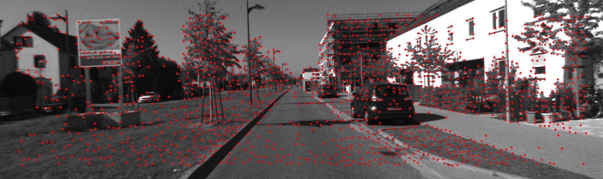

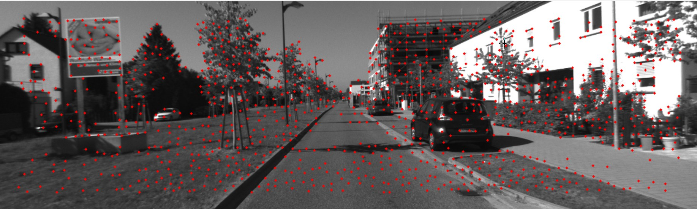


Сопоставление дескрипторов между двумя кадрами выполняется методом полного перебора, использующим расстояние Хэмминга для оценки близости бинарных признаков [30].


После применения описанных методов детектирования и сопоставления формируется два набора выходных данных, соответствующих каждому кадру: координаты ключевых точек и их бинарные дескрипторы. Ключевые точки определяют локальные области изображения, обладающие выраженными геометрическими структурами, тогда как дескрипторы представляют собой компактное численное описание окрестности каждой точки, позволяющее выполнять однозначное сопоставление между кадрами. 

Перед использованием в алгоритме инициализации соответствия проходят несколько этапов фильтрации, направленных на исключение неоднозначных и ненадёжных сопоставлений. На первой стадии выполняется проверка относительной близости дескрипторов, позволяющая отсеять совпадения, возникающие из-за слабой выраженности локальной структуры. Далее применяется геометрическая фильтрация, основанная на проверке согласованности найденных соответствий с допустимой моделью движения между кадрами. Заключительный этап фильтрации основан на анализе локальных ориентационных характеристик ключевых точек.

## **4.2.2. Вычисление фундаментальной матрицы и основной матрицы**

После получения набора надёжных соответствий между двумя кадрами следующим этапом инициализации является восстановление геометрического соотношения между наблюдениями. Это выполняется путём вычисления фундаментальной матрицы или так называемой основной матрицы, в зависимости от того, рассматриваются ли пиксельные координаты или нормализованные координаты камеры. Обе матрицы описывают эпиполярную геометрию и служат основой для оценки относительного движения камеры [25].

Эпиполярное соотношение между точками двух изображений записывается в виде
$$
x_2^\top F, x_1 = 0 ,
$$
где $x_1$ и $x_2$ — однородные координаты соответствующих точек на изображениях, а $F$ — фундаментальная матрица. Эта матрица определяет взаимное положение двух камер без использования сведений о внутренних параметрах и отражает связь между пиксельными наблюдениями.

Если внутренняя калибровка камеры известна, вместо фундаментальной используется **основная матрица**, вычисляемая по формуле
$$
E = K^\top F K ,
$$
где $K$ — матрица внутренних параметров камеры. Основная матрица задаёт эпиполярную геометрию уже в нормализованных координатах и непосредственно связана с относительным движением камеры между двумя наблюдениями. Она удовлетворяет условию
$$
x_2^{,n\top} E, x_1^{,n} = 0 ,
$$
где $x_1^{,n}$ и $x_2^{,n}$ — нормализованные координаты соответствующих точек.

Для восстановления параметров движения основная матрица разлагается на вращение и перенос по схеме
$$
E = [t]*\times R ,
$$
где $R$ — матрица вращения, описывающая изменение ориентации камеры, а $[t]*\times$ — кососимметричная матрица, порождённая вектором переноса $t$. Это разложение позволяет определить относительную позу между двумя кадрами и служит основой для последующей триангуляции начального набора трёхмерных точек.

## **4.2.3. Восстановление матриц вращения и переноса**

После вычисления основной матрицы выполняется восстановление параметров относительного движения камеры между двумя кадрами. Основная матрица содержит сведения о взаимном положении точек в нормализованных координатах и допускает разложение на компоненты вращения и переноса. Это разложение представляет собой ключевой этап инициализации, поскольку именно параметры $(R, t)$ определяют относительную позу камеры и служат основой для последующей триангуляции начального набора трёхмерных точек.

Разложение основной матрицы записывается в виде
$$
E = [t]*\times R ,
$$
где $R$ — матрица вращения, описывающая изменение ориентации камеры между двумя моментами времени, а $[t]*\times$ — кососимметричная матрица, порождённая вектором переноса $t$. Матрица $[t]*\times$ имеет вид
$$
[t]*\times =
\begin{pmatrix}
0     & -t_z &  t_y \
t_z   &  0   & -t_x \
-t_y  &  t_x &  0
\end{pmatrix},
$$
где $(t_x, t_y, t_z)$ — компоненты вектора переноса, определяющего направление базиса между двумя камерами.

На практике разложение выполняется через сингулярное разложение основной матрицы
$$
E = U \Sigma V^\top ,
$$
где $U$ и $V^\top$ — ортогональные матрицы, а $\Sigma$ — диагональная матрица сингулярных значений. На основе $U$ и $V$ восстанавливаются две возможные конфигурации вращения и два возможных направления переноса, что приводит к четырём потенциальным решениям. Выбор физически корректного решения достигается проверкой условий положительной глубины при триангуляции: корректным считается то решение, при котором восстановленные трёхмерные точки лежат перед плоскостью изображения обеих камер.

В результате выполнения этого этапа определяется матрица вращения
$$
R \in SO(3)
$$
и нормированный вектор переноса
$$
t \in \mathbb{R}^3 ,
$$
которые однозначно задают относительную позу камеры между двумя кадрами. Эти параметры используются для построения соответствующих матриц преобразования в $SE(3)$ и формируют основу для триангуляции начального набора трёхмерных точек и последующего построения карты.

## **4.2.4. Триангуляция нормализованных точек**

После восстановления относительных параметров движения камеры выполняется триангуляция, позволяющая перейти от двумерных нормализованных наблюдений к трёхмерным координатам точек сцены. Источником данных служат соответствия между двумя кадрами и матрицы поз камер, выраженные в виде преобразований из мировой системы координат в систему камеры. Результатом триангуляции становится первичное облако точек, формирующее базовый слой карты [31].

Два наблюдения одной и той же точки в нормализованных координатах задаются векторами
$$
x_1 = (u_1, v_1, 1)^\top,
\qquad
x_2 = (u_2, v_2, 1)^\top ,
$$
где $u_1, v_1$ — координаты точки в первом кадре, $u_2, v_2$ — координаты во втором кадре, единица является нормирующим коэффициентом для однородного представления.

Соответствующие позы камер представлены матрицами преобразований
$$
P_1 = T_{w\rightarrow c_1},
\qquad
P_2 = T_{w\rightarrow c_2},
$$
где $P_1$ и $P_2$ — проектирующие матрицы камер, $T_{w\rightarrow c_i}$ — преобразование из мировой системы координат в систему $i$-й камеры, включающее вращение и перенос.

Триангуляция записывается через однородную форму
$$
X_{h} = \operatorname{triangulate}(P_1, P_2, x_1, x_2),
$$
где $X_h$ — однородный вектор трёхмерной точки, содержащий координаты $(X_h^x,, X_h^y,, X_h^z,, X_h^w)$, оператор $\operatorname{triangulate}(\cdot)$ — алгоритм восстановления точки из двух наблюдений и двух поз камер [31].

Декартовы координаты трёхмерной точки в мировой системе получаются нормированием:
$$
X = \frac{1}{w}
\begin{pmatrix}
X_h^x \
X_h^y \
X_h^z
\end{pmatrix},
$$
где $w = X_h^w$ — масштабный коэффициент, возникающий при проективном отображении; $X$ — восстановленная трёхмерная точка.

Корректность триангуляции оценивается по глубине точки относительно обеих камер. Эта глубина определяется третьей координатой точки, преобразованной в систему каждой камеры. Если
$$
Z_1 > 0 \quad \text{и} \quad Z_2 > 0,
$$
где $Z_1$ и $Z_2$ — глубины точки в координатных системах первой и второй камер соответственно, то точка считается геометрически корректной и включается в начальную карту.

## **4.2.5. Фильтрация по параллаксу и геометрической состоятельности**

После выполнения триангуляции необходимо убедиться, что полученные трёхмерные точки действительно возникают из наблюдений реальных элементов сцены и не являются результатом вырожденных конфигураций или слишком малого смещения камеры между кадрами. Для этого выполняется фильтрация по параллаксу и проверка геометрической состоятельности. Оба критерия являются ключевыми на этапе инициализации, поскольку формируют устойчивый набор точек, на котором будет основана первая карта [25].

Параллакс характеризует изменение направления лучей, исходящих из двух различных поз камеры и проходящих через одну и ту же точку изображения. В нормализованной системе координат лучи задаются векторами
$$
v_1 = (u_1, v_1, 1),
\qquad
v_2 = (u_2, v_2, 1),
$$
где $u_1, v_1$ — нормализованные координаты точки в первом кадре, $u_2, v_2$ — координаты той же точки во втором кадре, а последняя компонента равна единице для перехода к трёхмерному направлению луча.

Угол параллакса между двумя лучами определяется формулой
$$
\cos\theta = \frac{v_1^\top v_2}{|v_1|;|v_2|},
$$
где $\theta$ — угол между направлениями лучей, $v_1^\top v_2$ — скалярное произведение векторов, $|v_1|$ и $|v_2|$ — их евклидовы нормы. Малые значения $\theta$ свидетельствуют о слабой геометрической определённости: точки при таком расположении лучей имеют большую неопределённость глубины и исключаются из дальнейшего рассмотрения.

Дополнительно выполняется проверка геометрической состоятельности триангулированных точек. Для каждой точки вычисляются её глубины в системах координат двух камер. Эти величины записываются как
$$
Z_i^{(1)} > 0,
\qquad
Z_i^{(2)} > 0 ,
$$
где $Z_i^{(1)}$ — глубина точки относительно первой камеры, $Z_i^{(2)}$ — глубина относительно второй камеры. Оба значения должны быть положительными, поскольку физически корректная точка должна находиться перед плоскостью изображения в обеих камерах. Нарушения этого условия свидетельствуют о некорректной комбинации параметров $(R, t)$ или ошибке в триангуляции.


# **4.3. Оптимизация на этапе инициализации**

После восстановления относительного движения и построения первичного облака трёхмерных точек выполняется дополнительная оптимизация, направленная на уточнение геометрии сцены и параметров позы камеры. На этапе инициализации такая оптимизация играет роль локального оптимизатора и позволяет устранить накопленные ошибки, возникающие при триангуляции и при разложении основной матрицы. В отличие от классических оптимизаторов, использующих методы типа Левенберга–Маркарда [26], в данной системе применяется градиентный подход, основанный на использовании тензорных вычислений [32 - 34].

В оптимизацию включаются три группы переменных. Первая группа — это трёхмерные координаты точек карты, представленные вектором $X$, каждая компонента которого подлежит обновлению. Вторая группа — параметры позы текущего ключевого кадра, включающие матрицу вращения и вектор переноса. Вращение параметризуется не напрямую, а через вспомогательный вектор в Ли-алгебре $\omega$, позволяющий получать ортогональную матрицу с помощью экспоненциального отображения. Третья группа данных — это набор наблюдений, включающий координаты ключевых точек в изображении, которые выступают в роли целевых значений при вычислении ошибки репроекции.

Функция потерь формируется на основе сравнения целевых координат ключевых точек и их предсказанных положений, вычисленных через проекцию трёхмерной точки в координатную систему камеры. Для каждой точки вычисляется преобразование
$$
X_c = R X + t ,
$$
где $R$ — матрица вращения камеры, $t$ — вектор её переноса, а $X_c$ — координаты точки в системе камеры. Полученная точка затем проектируется в плоскость изображения по формуле
$$
u = f_x \frac{X_c^x}{X_c^z} + c_x,
\qquad
v = f_y \frac{X_c^y}{X_c^z} + c_y ,
$$
где $f_x, f_y$ — фокусные параметры камеры, $(c_x, c_y)$ — главная точка, а $(u, v)$ — предсказанные пиксельные координаты. Отклонение между предсказанными координатами и исходными наблюдениями формирует ошибку репроекции, которая затем агрегируется в суммарную функцию потерь. Для устойчивости к выбросам используется робастная функция ошибки типа Huber [41], сглаживающая большие отклонения и уменьшающая влияние неправильных соответствий.

В качестве метода оптимизации применяется алгоритм Adam — адаптивный градиентный метод, обладающий стабильностью и хорошей сходимостью на негладких и сильно нелинейных функциях. Он обновляет как координаты трёхмерных точек, так и параметры позы камеры на основе градиентов, которые автоматически вычисляются встроенными механизмами PyTorch [18]. 

Для наглядного представления последовательности этапов, выполняемых в процессе моно-инициализации, ниже приводится формальный псевдокод алгоритма. Он отражает основные вычислительные шаги, включающие извлечение и сопоставление признаков, оценку эпиполярной геометрии, восстановление относительной позы камеры, триангуляцию пространственных точек и формирование двух начальных ключевых кадров, на основе которых в дальнейшем строится локальная карта и запускается модуль трекинга. Ознакомиться с кодом инициализации можно в приложении (Приложение 1).

```
ФУНКЦИЯ INITIALIZE(frame_1, frame_2, K):

    keypoints_1, descriptors_1 ← DetectAndDescribe(frame_1)
    keypoints_2, descriptors_2 ← DetectAndDescribe(frame_2)

    matches_raw ← MatchDescriptors(descriptors_1, descriptors_2)
    matches ← FilterMatches(matches_raw)

    pts1_norm ← NormalizePoints(keypoints_1[matches[:,0]], K)
    pts2_norm ← NormalizePoints(keypoints_2[matches[:,1]], K)

    F ← EstimateFundamentalMatrix(pts1_norm, pts2_norm)
    E ← Kᵀ F K

    (R_candidates, t_candidates) ← DecomposeEssentialMatrix(E)

    best_pose ← NULL
    best_points ← ∅

    ДЛЯ каждого (R, t) из кандидатов:
        P1 ← [I | 0]
        P2 ← [R | t]
        X ← TriangulatePoints(P1, P2, pts1_norm, pts2_norm)
        X ← FilterInvalidDepth(X, R, t)
        parallax ← ComputeParallax(pts1_norm, pts2_norm)

        ЕСЛИ parallax < PARALLAX_THRESHOLD:
            ПРОДОЛЖИТЬ

        valid_ratio ← CountValidPoints(X) / |X|

        ЕСЛИ valid_ratio > BEST_RATIO:
            best_pose ← (R, t)
            best_points ← X

    (R_init, t_init) ← best_pose
    X_init ← best_points

    keyframe_1 ← CreateKeyframe(frame_1, I, 0)
    keyframe_2 ← CreateKeyframe(frame_2, R_init, t_init)

    Map ← CreateEmptyMap()

    ДЛЯ каждого X_i в X_init:
        point ← CreateMapPoint(X_i)
        Map.Insert(point)

    OptimizeInitialStructure(keyframe_1, keyframe_2, Map, K)

    ВОЗВРАТ (keyframe_1, keyframe_2, Map)
```

Где $frame_1$ и $frame_2$ обозначают два последовательных изображения видеопоследовательности; $K$ представляет собой матрицу внутренних параметров камеры; $kpts_1$ и $kpts_2$ — координаты выделенных ключевых точек в первом и втором кадре; $desc_1$ и $desc_2$ — соответствующие бинарные дескрипторы; $matches$ — согласованные пары точек, полученные после сопоставления дескрипторов и фильтрации; $pts1$ и $pts2$ — нормализованные координаты совпавших точек, вычисленные с использованием матрицы $K$; $F$ — фундаментальная матрица, описывающая эпиполярные ограничения между двумя кадрами; $E$ — основная матрица, определяющая относительное вращение и перенос камеры; $(R_{cands}, t_{cands})$ — множество кандидатов на ориентацию и направление переноса, полученных разложением матрицы $E$; $P_1$ и $P_2$ — проектирующие матрицы для двух положений камеры; $X$ — множество триангулированных трёхмерных точек; $parallax$ — оценка угла между направляющими лучами соответствующих наблюдений; $valid_ratio$ — доля корректно реконструированных точек относительно их общего количества; $(R_{init}, t_{init})$ — выбранная начальная поза второй камеры; $X_{init}$ — первичное облако точек, прошедших фильтрацию; $keyframe_1$ и $keyframe_2$ — стартовые ключевые кадры SLAM; $Map$ — структура данных карты, содержащая трёхмерные точки; $OptimizeInitialStructure$ — процедура локальной оптимизации, уточняющая начальные значения поз и структуры сцены.


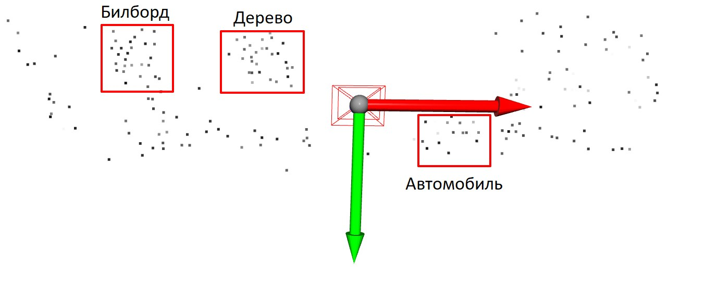

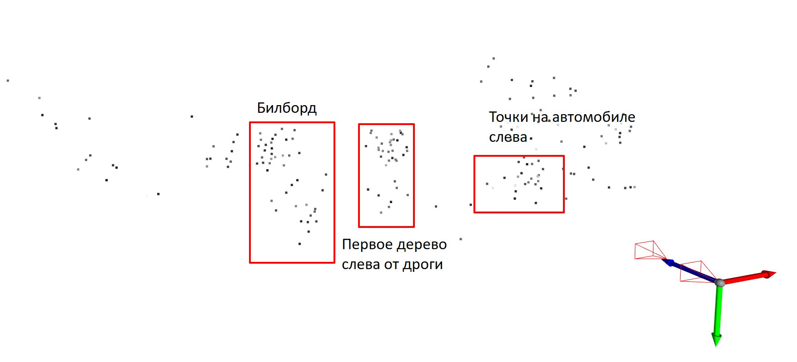

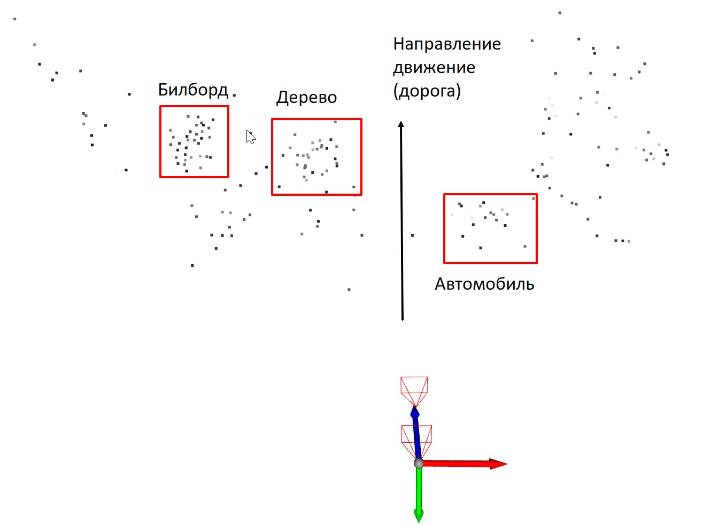

# **5. Модуль мониторинга кадров (трекинга)**

Модуль мониторинга кадров обеспечивает непрерывное сопровождение видеопотока после завершения инициализации и отвечает за обработку каждого нового входного изображения. Его задача заключается в выделении информативных признаков, сопоставлении их с эталонными элементами карты и обеспечении корректного перехода к этапам оценки позы, триангуляции и локальной оптимизации. В рамках этого модуля поддерживается внутренняя структура ключевых кадров и накопленных трёхмерных точек, а также выполняются все операции, необходимые для поддержания согласованности карты и траектории камеры в реальном времени.

## **5.1. Обнаружение и сопоставление признаков**

Каждый вновь поступающий кадр проходит обработку, аналогичную этапу инициализации. На изображении выделяются ключевые точки и вычисляются их дескрипторы с использованием того же детектора и метода описания, что и на этапе инициализации. 

Полученные дескрипторы сопоставляются с набором признаков последнего ключевого кадра, который выступает эталонным. Сопоставление выполняется с использованием метода поиска ближайших дескрипторов, после чего полученные соответствия проходят фильтрацию для удаления ложных совпадений. Фильтрация включает оценку относительной близости дескрипторов, проверку согласованности ориентации и исключение геометрически неподтверждённых пар.

В результате обработки формируется набор устойчивых соответствий между текущим изображением и ключевым кадром, который используется на следующем этапе для восстановления позы камеры, обновления карты и принятия решения о добавлении нового ключевого кадра.


## **5.2. Оценка позиции текущего кадра**

На основе сопоставленных признаков между текущим кадром и последним ключевым кадром выполняется вычисление относительной позиции камеры. Для этого используется задача определения позы по набору трёхмерных точек и соответствующих им двухмерных наблюдений, известная как задача PnP (Perspective-n-Point) [19]. Её цель заключается в нахождении матрицы преобразования камеры, включающей вращение и перенос, при котором проекции трёхмерных точек на изображение наиболее согласуются с фактическими наблюдениями.

Постановка PnP опирается на уже имеющиеся трёхмерные точки из локальной карты и совпадения между их проекциями и ключевыми точками текущего кадра. На вход алгоритму подаются пары вида $(X_i,, x_i)$, где $X_i$ — точка в мировой системе координат, а $x_i$ — её двумерное соответствие на изображении. Решение задачи позволяет вычислить параметры позы текущего кадра относительно выбранного ключевого кадра.

Для повышения устойчивости оценка выполняется с использованием RANSAC [35]. Этот метод последовательно отбрасывает несогласованные наблюдения, формирующие выбросы, и оценивает преобразование по согласованным данным.

## **5.3. Обновление видимости карты**

После восстановления позиции текущего кадра выполняется обновление видимости карты, то есть фиксация того, какие трёхмерные точки были успешно наблюдены в новом изображении.

Для всех точек карты, которые имеют корректные соответствия с ключевыми точками текущего кадра, выполняется добавление нового наблюдения. Каждая такая точка получает дополнительную привязку в виде координат её проекции на текущем изображении. Соответствующие записи добавляются как в структуру точки, так и в структуру кадра, обеспечивая двустороннюю связь «точка - кадр». Эта связь используется в дальнейшем при триангуляции новых точек и оптимизации поз.

# **6. Ключевые кадры**

Ключевые кадры образуют структурный каркас SLAM-системы и служат опорными состояниями, на которых строится карта и восстанавливается траектория движения камеры. В отличие от обычных кадров, обрабатываемых непрерывно в процессе трекинга, ключевые кадры фиксируют наиболее информативные наблюдения и обеспечивают долгосрочную устойчивость восстановления сцены. Каждый такой кадр содержит набор данных, необходимых для триангуляции, оптимизации и поддержания структуры карты.

## **6.1. Критерии вставки нового ключевого кадра**

Вставка нового ключевого кадра выполняется только тогда, когда текущий кадр содержит достаточно новой информации, чтобы обоснованно расширять карту. Одним из основных критериев является величина параллакса относительно предыдущего ключевого кадра: если смещение камеры приводит к существенному изменению направления наблюдения, добавление ключевого кадра позволяет получить новые трёхмерные точки и улучшить геометрическую структуру.

Если число видимых трёхмерных точек становится недостаточным — например, из-за быстрого движения камеры, смены ракурса или появления слаботекстурных участков — текущее изображение также рассматривается как кандидат для ключевого. Аналогичным образом сильное изменение позы, включая выраженный поворот камеры или значительный перенос, приводит к ухудшению качества трекинга и снижению количества надёжных соответствий.

## **6.2. Структура ключевого кадра**

Каждый ключевой кадр содержит всю необходимую информацию для дальнейшего анализа и обновления карты. Его основной компонент — матрица позы, представляющая собой преобразование в группе $SE(3)$, которое описывает положение камеры в мировой системе координат.

Помимо позы ключевой кадр хранит набор выделенных визуальных признаков, включая координаты ключевых точек и их дескрипторы. Эти признаки служат основой для последующего сопоставления с будущими кадрами и для триангуляции новых трёхмерных точек.

Также ключевой кадр содержит ссылки на те точки карты, которые наблюдаются в нём, формируя двусторонние связи между 2D-наблюдениями и 3D-структурой. 

# **7. Оптимизация**

После добавления новых трёхмерных точек работа системы не прекращается, и процесс обновления карты продолжается в непрерывном режиме. Ключевой кадр служит лишь точкой расширения структуры, после чего SLAM-пайплайн переходит к следующему этапу — локальной оптимизации. Локальная оптимизация выполняется в рамках отдельного фонового потока, который обрабатывает ограниченную область карты, связанную с текущим ключевым кадром, включая ближайшие опорные кадры и соответствующие им трёхмерные точки. Целью локального процесса является уточнение поз и геометрии карты путем минимизации ошибки репроекции в малом окне, что позволяет стабилизировать структуру и компенсировать накопленные ошибки.

Параллельно с локальной оптимизацией функционирует независимый поток глобальной оптимизации, который отслеживает появление событий, связанных с возможными замыканиями петель или значительными нарушениями согласованности структуры карты.

Поскольку и локальная, и глобальная оптимизация обращаются к общей карте, содержащей все трёхмерные точки, ключевые кадры и их взаимосвязи, критически важно обеспечить корректную синхронизацию доступа. Общая карта является разделяемой структурой данных, к которой одновременно обращаются несколько потоков: один поток может обновлять позы ключевых кадров, другой — модифицировать координаты точек, третий — добавлять новые элементы. Чтобы исключить появление несогласованных состояний, деформации данных и разрушение структуры, доступ к карте блокируется при каждом обращении. Блокировки обеспечивают атомарное выполнение операций и гарантируют, что ни один из потоков не будет работать с частично обновлёнными или ещё не завершёнными данными.

Таким образом, система использует многопоточную архитектуру, в которой локальная и глобальная оптимизации работают автономно, но взаимодействуют через общую карту.

## **7.1. Локальная оптимизация**

Локальная оптимизация выполняется для уточнения поз ключевых кадров и координат трёхмерных точек в ограниченном окне карты, содержащем текущий ключевой кадр и несколько его соседних опорных кадров. Основная цель состоит в минимизации ошибки репроекции для всех наблюдений в этом локальном окне.

Оптимизация основана на совместном обновлении двух типов параметров: поз ключевых кадров и координат трёхмерных точек. Для каждого ключевого кадра поза представляется преобразованием в группе $SE(3)$, параметризованным через вектор Ли группы, из которого матрица вращения строится с помощью экспоненциального отображения. Трёхмерные точки хранятся в мировой (глобальной) системе координат и подлежат прямому обновлению [24].

Первым шагом вычисляется переход трёхмерной точки в систему координат камеры:
$$
X_c = R X + t ,
$$
где $X_c$ — координаты точки в системе камеры; $X$ — трёхмерная точка в мировой системе; $R$ — матрица вращения ключевого кадра; $t$ — вектор переноса.

Следующим этапом выполняется проектирование этой точки на плоскость изображения:
$$
u = f_x \frac{X_c^x}{X_c^z} + c_x,
\qquad
v = f_y \frac{X_c^y}{X_c^z} + c_y ,
$$
где $(u, v)$ — предсказанные пиксельные координаты точки; $(X_c^x, X_c^y, X_c^z)$ — компоненты точки в координатах камеры; $f_x, f_y$ — фокусные параметры камеры; $c_x, c_y$ — координаты главной точки.

На основе получённых проекций формируется остаток (ошибка репроекции):
$$
e =
\begin{pmatrix}
u_{\text{набл}} - u \
v_{\text{набл}} - v
\end{pmatrix},
$$
где $u_{\text{набл}}, v_{\text{набл}}$ — фактические координаты точки в изображении; $u, v$ — предсказанные координаты, полученные через модель камеры.

Совокупная функция потерь локального окна определяется суммой робастных значений ошибок:
$$
\mathcal{L} = \sum_{i=1}^{N} \rho!\left(| e_i |^2\right),
$$
где $\mathcal{L}$ — итоговая функция потерь; $e_i$ — ошибка репроекции для $i$-го наблюдения;
$N$ — число наблюдений в локальном окне; $\rho(\cdot)$ — робастная функция (Huber), уменьшающая влияние аномальных соответствий.

Минимизация функции потерь выполняется методом адаптивного градиентного спуска Adam, благодаря чему все параметры — вектор углов вращения, вектор переноса и координаты трёхмерных точек — рассматриваются как дифференцируемые тензоры [32]. PyTorch автоматически вычисляет градиенты:
$$
\theta_{k+1} = \theta_k - \alpha \frac{m_k}{\sqrt{v_k} + \varepsilon},
$$
где $\theta_k$ — множество оптимизируемых параметров на итерации $k$; $\alpha$ — шаг обучения;
$m_k$ — экспоненциально усреднённый градиент; $v_k$ — экспоненциально усреднённый квадрат градиента; $\varepsilon$ — числовой стабилизатор.

## **7.2. Глобальная оптимизация**

Глобальная оптимизация является завершающим и наиболее комплексным этапом обработки, направленным на обеспечение согласованности всей структуры карты и траектории движения камеры на длительном интервале времени. В отличие от локальной оптимизации, которая затрагивает только небольшой набор ключевых кадров и связанных с ними трёхмерных точек, глобальная оптимизация охватывает всю накопленную карту и выполняется в отдельном фоновом потоке. Это позволяет корректировать значительные структурные и метрические искажения, неизбежно возникающие в процессе длительного трекинга.

Основная задача глобальной оптимизации состоит в минимизации ошибки между всеми наблюдениями, накопленными в системе, и соответствующими им трёхмерными точками при сохранении целостности графа поз. Все ключевые кадры рассматриваются как вершины графа, а геометрические связи между ними — как ребра, включающие наблюдения, триангуляции и, при наличии, замыкания петель. Замыкания петель вносят дополнительные ограничения, позволяющие устранить накопившийся дрейф и обеспечить метрическую согласованность структуры карты.

В процессе глобальной оптимизации основным объектом корректировки являются позы всех ключевых кадров, представленные преобразованиями группы $SE(3)$. Пусть каждая поза обозначается матрицей
$$
T_i =
\begin{pmatrix}
R_i & t_i \
0   & 1
\end{pmatrix},
$$
где $R_i$ — матрица вращения камеры для $i$-го ключевого кадра, а $t_i$ — соответствующий вектор переноса.
Эти параметры подлежат совместному уточнению для того, чтобы все наблюдения, накопленные системой, согласовывались между собой.

Ошибка репроекции для всех точек записывается как
$$
e_{ij} =
x_{ij}^{\text{набл}} - K,\pi!\left(R_i X_j + t_i\right),
$$
где $e_{ij}$ — ошибка наблюдения точки $X_j$ в $i$-м ключевом кадре;
$x_{ij}^{\text{набл}}$ — измеренные координаты точки;
$K$ — матрица внутренних параметров;
$\pi(\cdot)$ — оператор перспективной нормализации.

Суммарная функция потерь имеет вид
$$
\mathcal{L}*{\text{global}} = \sum*{i,j} \rho!\left(|e_{ij}|^2\right),
$$
где суммирование выполняется по всем ключевым кадрам $i$ и по всем видимым трёхмерным точкам $j$, а функция $\rho$ — робастная, что снижает влияние ошибок сопоставления.

Глобальная оптимизация должна корректировать прежде всего позы ключевых кадров, поскольку именно они накапливают основной дрейф при длительном наблюдении. Координаты трёхмерных точек могут оставаться фиксированными либо также участвовать в оптимизации, в зависимости от выбранной стратегии. Полная совместная оптимизация всех поз и всех точек соответствует классической глобальной оптимизации, тогда как частичная фиксация точек уменьшает вычислительную сложность, сохраняя при этом основные преимущества.

Поскольку эта процедура требует обработки большого количества данных и обладает высокой вычислительной стоимостью, она выполняется в отдельном потоке, работающем параллельно с основными задачами трекинга и локальной оптимизации. Такой подход позволяет выполнять глобальную корректировку структуры карты асинхронно и не нарушает работу основного SLAM-цикла. После завершения очередной глобальной оптимизации обновлённые позы ключевых кадров интегрируются в общую карту, обеспечивая её согласованность и устраняя накопившиеся искажения.

## **7.3. Сравнение с классическими методами оптимизации**

В традиционных системах SLAM процедуры локальной и глобальной оптимизации реализуются через классические варианты нелинейного оптимизационного метода Левенберга–Маркарда или его производных [26,36, 37]. Такие алгоритмы используют аналитические или численно вычисленные якобианы и решают последовательность линейных систем, аппроксимирующих исходную задачу минимизации ошибки репроекции. Подход с матричной факторизацией отличается высокой точностью и быстрым сходимым поведением, однако требует сложной реализации, ручного управления структурой якобианов, а также применения специализированных библиотек, таких как Ceres или g2o [38, 39].

В представленной системе реализована альтернативная схема оптимизации, основанная на возможностях автоматического дифференцирования и тензорных вычислений. Вместо матричных разложений используется градиентный метод адаптивного типа, при котором параметры — позы ключевых кадров и координаты трёхмерных точек — рассматриваются как дифференцируемые тензоры. Оптимизация выполняется методами семейства адаптивного градиентного спуска (в частности, Adam).

Такой подход обладает рядом преимуществ. Он упрощает архитектуру оптимизации, позволяя отказаться от ручного вывода частных производных и сложных матричных структур. Автоматическое дифференцирование обеспечивает корректность вычисления градиентов и допускает легко масштабируемую интеграцию дополнительных компонентов, включая нейросетевые модули.

Наряду с преимуществами, градиентные методы имеют и ограничения по сравнению с классическими алгоритмами. Они требуют большего числа итераций для достижения сходимости и более чувствительны к выбору шагов обновления. В отличие от методов второго порядка, основанных на гессиновых аппроксимациях, они не используют локальную кривизну функции потерь, что иногда приводит к меньшей точности конечного решения.

Предложенная схема представляет собой современную альтернативу классическим методам нелинейной оптимизации. Ознакомиться с кодом оптимизатора можно в приложении (Приложение 2).

# **8. Проведение эксперимента**

## **8.1. Условия эксперимента**

Для оценки работоспособности и устойчивости разработанного алгоритма была проведена серия вычислительных экспериментов на видеопоследовательностях из открытого датасета KITTI [40]. Экспериментальные данные представляли собой упорядоченные последовательности изображений, поступающих от монокулярной камеры, что соответствует рассматриваемой постановке задачи визуальной одометрии и картографирования.

В рамках данной работы был разработан собственный программный фреймворк для функционирования SLAM-системы, реализованный на языке Python. Фреймворк представляет собой набор взаимосвязанных модулей, обеспечивающих полный вычислительный цикл обработки видеопотока, начиная с инициализации и заканчивая формированием локальной карты и визуализацией результатов. Архитектура программной реализации ориентирована на модульность и расширяемость, что позволяет поэтапно развивать систему и дополнять её новыми компонентами.

На текущем этапе разработки в составе фреймворка реализованы модули начальной инициализации, основного трекинга, управления картой и ключевыми кадрами, локальной оптимизации, хранения промежуточных данных, а также модуль визуализации, предназначенный для анализа траектории движения камеры и структуры построенной карты.

Модули замыкания петель и глобальной оптимизации на момент проведения экспериментов находятся в стадии активной разработки. Их реализация сопряжена с рядом методических и вычислительных трудностей, связанных с масштабируемостью, устойчивостью оптимизационных процедур и корректным выявлением повторных наблюдений. Несмотря на это, разработка данных компонентов продолжается, и их интеграция в существующий программный контур рассматривается как следующий этап развития системы.

Экспериментальные исследования проводились в условиях, приближённых к сценарию использования на мобильных робототехнических платформах и беспилотных летательных аппаратах. Для выполнения экспериментов использовался стандартный портативный ноутбук, оснащённый центральным процессором среднего уровня и интегрированным графическим ускорителем.

Запуск SLAM-системы осуществлялся посредством конфигурационного механизма, позволяющего задавать параметры работы отдельных модулей без изменения исходного кода. В конфигурации определялись параметры детектирования и сопоставления визуальных признаков, настройки трекинга, критерии добавления ключевых кадров и параметры локальной оптимизации (Таблица 1). В ходе экспериментов применялась схема выделения признаков, основанная на комбинации методов FAST, ORB и ANMS, обеспечивающая достаточную плотность и устойчивость наблюдений на рассматриваемых сценах.

Эксперимент на данном этапе носит исследовательский характер и направлен на проверку корректности и адекватности уже реализованных компонентов SLAM-системы. Основной целью является оценка способности разработанного программного фреймворка выполнять восстановление траектории движения камеры и формирование трёхмерного облака точек на основе необработанного видеопотока, без использования априорной информации о структуре сцены. Полученные результаты служат основанием для дальнейшей доработки системы, в том числе для интеграции механизмов замыкания петель и глобальной оптимизации.

**Таблица 1 — Использованные параметры эксперимента**

| Параметр                         | Значение               |
| -------------------------------- | ---------------------- |
| Минимальное число инлаеров       | 10                     |
| Минимальный параллакс            | 0.5°                   |
| Интервал вставки ключевых кадров | 3 кадра                |
| Порог смещения камеры            | 2.0                    |
| Порог углового поворота          | 10°                    |
| Минимум совпадений для keyframe  | 30                     |
| Метод оптимизации                | Adam                   |
| Скорость обучения                | $10^{-4}$              |
| Число итераций                   | 20                     |
| Робастная функция                | $\delta = 5.0$ |

## **8.2. Выводы**

В ходе тестового прогона разработанного алгоритма на последовательности датасета KITTI система успешно прошла этап инициализации. Начальные ключевые кадры были сформированы корректно, первичное облако трёхмерных точек реконструировано (рисунок - рисунок ), и относительная поза камеры на ранних кадрах соответствовала визуально наблюдаемой динамике сцены  (). Это подтверждает корректность реализации процедур выделения признаков, сопоставления, вычисления основной матрицы, восстановления позы и триангуляции.

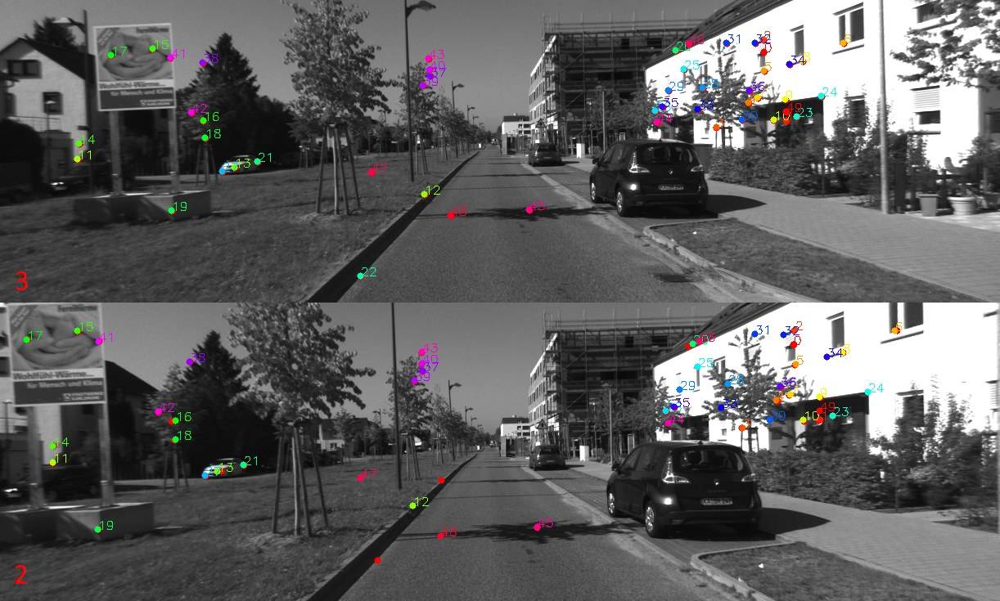

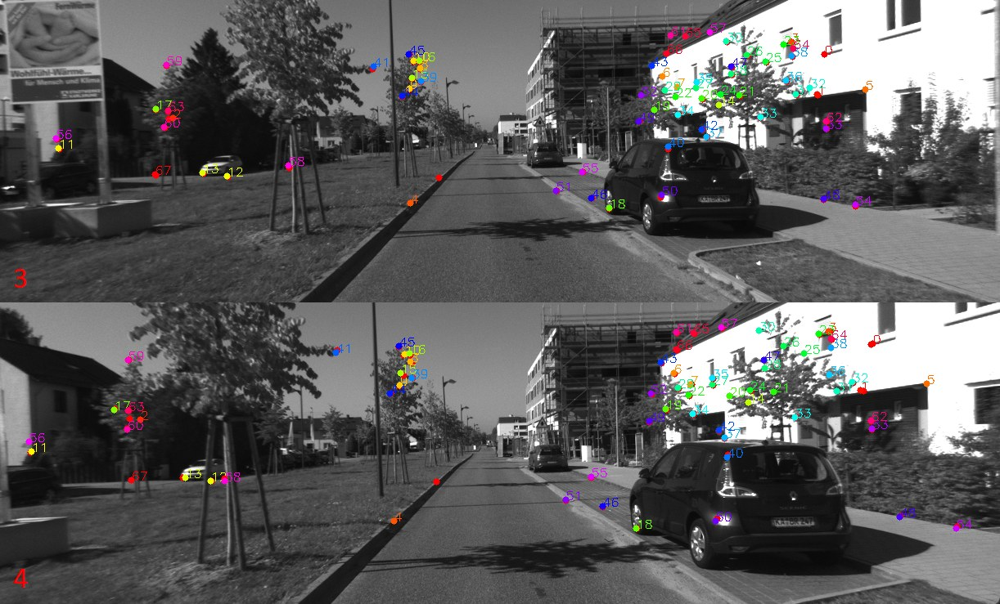

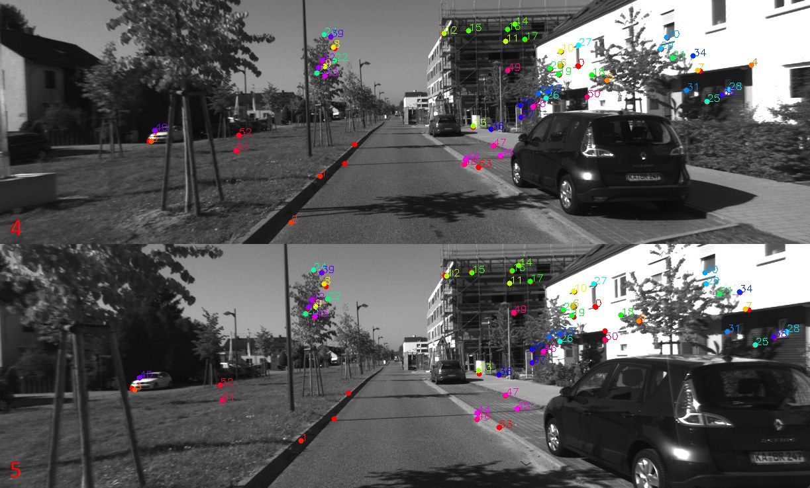

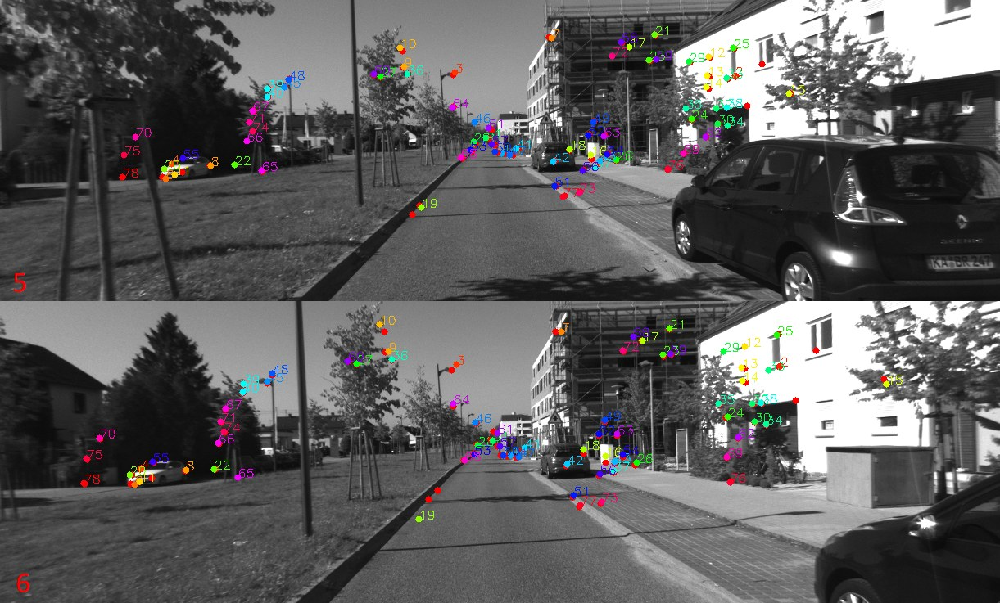

При переходе системы в режим регулярного трекинга и последовательного расширения карты были выявлены ограничения, связанные с накоплением геометрической ошибки во времени. Несмотря на то, что отдельные трёхмерные точки реконструируются корректно, при добавлении новых кадров наблюдается постепенный рост ошибки репроекции. Эта ошибка накапливается от кадра к кадру вследствие неточного обновления позы и структуры карты, а также ограниченной частоты выполнения оптимизационных процедур.

Основной причиной данного эффекта является вычислительная сложность локальной оптимизации, реализованной с использованием тензорных методов и автоматического дифференцирования. Такой подход обеспечивает высокую гибкость и удобство экспериментирования с функциями ошибки, однако приводит к существенным временным затратам. В результате оптимизация не успевает выполняться с необходимой периодичностью, особенно при росте числа наблюдаемых точек и ключевых кадров. Это приводит к тому, что параметры позы камеры обновляются на основе устаревшей или недостаточно согласованной карты.

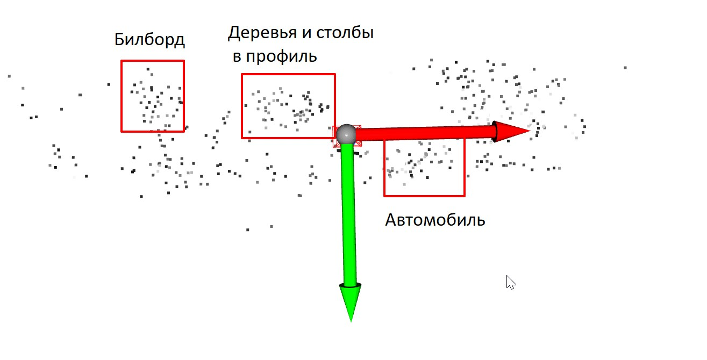

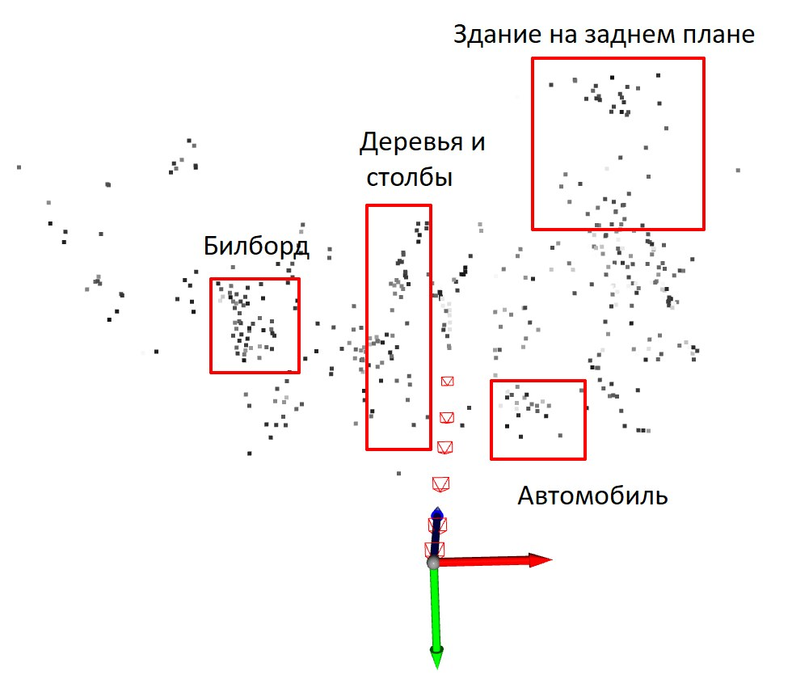

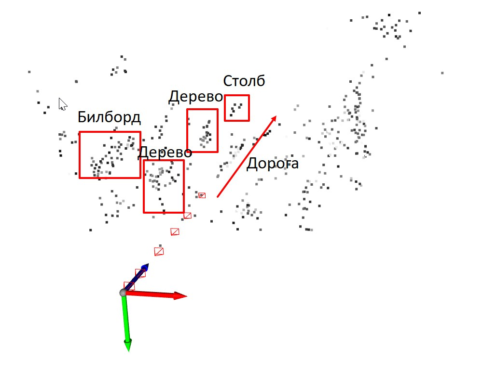

Дополнительным фактором, влияющим на устойчивость системы, является стратегия добавления ключевых кадров. При редком добавлении ключевых кадров геометрическая ошибка успевает накопиться до значений, при которых метод восстановления позы (PnP) перестаёт находить корректное решение. Это связано с уменьшением числа инлаеров и ростом расхождения между наблюдаемыми и предсказанными проекциями. В таком режиме трекинг теряет устойчивость, и процесс восстановления траектории прерывается.

Попытка компенсировать данный эффект за счёт увеличения частоты добавления ключевых кадров приводит к противоположной проблеме. Существенно возрастает число создаваемых трёхмерных точек, что увеличивает размер локальной карты и, как следствие, усложняет оптимизационные задачи. При этом рост плотности карты не сопровождается пропорциональным снижением ошибки репроекции, а в ряде случаев приводит к её дополнительному увеличению из-за недостаточной фильтрации и переопределённости наблюдений. Таким образом, наблюдается компромисс между частотой ключевых кадров, размером карты и вычислительной устойчивостью системы.

Полученные результаты позволяют сделать вывод о том, что текущая реализация корректно решает задачу начальной реконструкции и демонстрирует принципиальную работоспособность разработанного SLAM-фреймворка. Вместе с тем устойчивость системы на длинных последовательностях в значительной степени ограничена выбранным подходом к оптимизации. Для дальнейшего развития проекта требуется более глубокая проработка оптимизационного блока, включая возможный переход к графовым методам оптимизации, аналогичным используемым в ORB-SLAM или PySLAM, либо разработка гибридной схемы, сочетающей тензорную оптимизацию с классическим фактор-графовым представлением.

Дополнительным направлением развития является оптимизация вычислительного процесса, включая снижение размерности оптимизируемых параметров, адаптивный выбор активных точек и ключевых кадров, а также более агрессивную фильтрацию наблюдений. Реализация этих подходов рассматривается как необходимый шаг для обеспечения устойчивой работы SLAM-системы в режиме реального времени и её дальнейшего применения на мобильных платформах, включая беспилотные летательные аппараты.

Тестовый запуск показал, что начальная стадия SLAM функционирует стабильно, однако дальнейшая работа ограничена скоростью оптимизационных процедур. Для обеспечения устойчивой работы системы требуется снижение вычислительной нагрузки или переход к более эффективным схемам оптимизации, позволяющим выполнять обновление карты в реальном времени без чрезмерного накопления ошибок.

# **9. Перспективы развития системы**

Разработанная SLAM-система обладает значительным потенциалом для дальнейшего развития благодаря тому, что её реализация полностью основана на языке Python и использует модульную архитектуру. Отсутствие жёсткой связности с внешними C++-библиотеками позволяет проводить исследования без необходимости сложной сборки и компиляции зависимостей, что существенно облегчает отладку и экспериментирование.

Одним из перспективных направлений развития является расширение набора алгоритмов оптимизации. Несмотря на то, что в текущей версии используется тензорная оптимизация на основе методов адаптивного градиентного спуска, остаётся возможность внедрения классических графовых методов с использованием специализированных библиотек. Тензорные методы, позволяют легко включать новые параметры и использовать автоматическое дифференцирование, а при наличии графического ускорителя обеспечивают достаточно высокую производительность. Это направление может стать основой для дальнейшего исследования возможностей гибридных схем оптимизации.

Перспективным является также развитие нейросетевых компонентов. Встроенная архитектура системы и использование PyTorch открывают возможности интеграции современных методов обнаружения признаков, сопоставления, оценки движения и даже полной дифференцируемой реконструкции. В дальнейшем возможно включение обучаемых модулей, предназначенных для коррекции поз, улучшения триангуляции или повышения устойчивости трекинга в условиях сложных сцен.

Гибкая модульная структура системы позволяет использовать различные типы камер без значительных изменений в кодовой базе. Уже заложена поддержка моно-, стерео- и RGB-D-камер, а также возможность подключения мультиобъективных конфигураций. Это создаёт основу для расширения функциональности SLAM-системы и адаптации её для широкого спектра задач робототехники и компьютерного зрения.

Ещё одним направлением является интеграция с экосистемами разработки робототехнических систем, такими как ROS. Благодаря тому, что система реализована на Python и обладает чётко определёнными интерфейсами, её можно интегрировать в существующие программно-аппаратные комплексы, обеспечивая обмен данными с датчиками, системами управления и внешними модулями обработки.

# **10. Заключение**

В ходе работы была разработана и экспериментально проверена модульная SLAM-система, реализованная полностью на языке Python и использующая тензорный вычислительный подход для оптимизации. Построенная архитектура включает процедуры инициализации, трекинга, формирования ключевых кадров, триангуляции, локальной оптимизации и механизмов дальнейшего расширения до глобальной оптимизации. Проведённые тестовые эксперименты подтвердили корректность реализации ключевых этапов: алгоритм уверенно проходит стадию инициализации, формирует первичное облако трёхмерных точек и обеспечивает реконструкцию траектории на начальных участках видеопоследовательности.

Полученные результаты демонстрируют работоспособность предложенной схемы и подтверждают возможность применения выбранного подхода для построения визуальной одометрии и картографирования по данным монокулярной камеры. Анализ функционирования системы выявил ограничения, связанные прежде всего с вычислительной сложностью тензорной оптимизации, что приводит к снижению скорости работы на последовательностях значительной длины. Несмотря на это, структура алгоритма позволяет гибко адаптировать модули оптимизации, трекинга и обработки карты для достижения более высокой производительности.

Технический эффект, достигнутый в ходе разработки, заключается в создании полностью программной платформы, пригодной для тестирования различных алгоритмических решений без необходимости выполнения сложной компиляции и интеграции внешних библиотек. Система может служить экспериментальной средой для разработки новых методов экстракции признаков, сопоставления, оптимизации и реконструкции, включая внедрение графовых и нейросетевых подходов.

Перспективы применения разработанного решения охватывают задачи робототехники, автономной навигации и анализа визуальных данных. Модульная архитектура, ориентация на динамическое обновление карты и использование современных подходов к оптимизации создают основу для дальнейшего развития системы и её интеграции в более сложные робототехнические и компьютерно-зрительные комплексы.

# **Используемые источники**


1. Mur-Artal R., Montiel J. M. M., Tardós J. D. ORB-SLAM: A versatile and accurate monocular SLAM system // *IEEE Transactions on Robotics*. — 2015. — Vol. 31, № 5. — P. 1147–1163.

2. Engel J., Koltun V., Cremers D. Direct sparse odometry // *IEEE Transactions on Pattern Analysis and Machine Intelligence*. — 2017. — Vol. 40, № 3. — P. 611–625.

3. Engel J., Schöps T., Cremers D. LSD-SLAM: Large-scale direct monocular SLAM // *Proceedings of the European Conference on Computer Vision (ECCV)*. — Cham: Springer, 2014. — P. 834–849.

4. Lowe D. G. Distinctive image features from scale-invariant keypoints // *International Journal of Computer Vision*. — 2004. — Vol. 60, № 2. — P. 91–110.

5. Bay H., Tuytelaars T., Van Gool L. SURF: Speeded up robust features // *Proceedings of the European Conference on Computer Vision (ECCV)*. — Berlin; Heidelberg: Springer, 2006. — P. 404–417.

6. Klein G., Murray D. Parallel tracking and mapping for small AR workspaces // *Proceedings of the IEEE International Symposium on Mixed and Augmented Reality*. — Nara, 2007. — P. 225–234.

7. Newcombe R. A., Lovegrove S., Davison A. J. DTAM: Dense tracking and mapping in real-time // *Proceedings of the IEEE International Conference on Computer Vision (ICCV)*. — Barcelona, 2011. — P. 2320–2327.

8. Mur-Artal R., Tardós J. D. ORB-SLAM2: An open-source SLAM system for monocular, stereo, and RGB-D cameras // *IEEE Transactions on Robotics*. — 2017. — Vol. 33, № 5. — P. 1255–1262.

9. Wang S., Clark R., Wen H., Trigoni N. DeepVO: Towards end-to-end visual odometry with deep recurrent convolutional neural networks // *Proceedings of the IEEE International Conference on Robotics and Automation (ICRA)*. — Singapore, 2017. — P. 2043–2050.

10. Teed Z., Deng J. DROID-SLAM: Deep visual SLAM for stereo and monocular cameras // *Advances in Neural Information Processing Systems (NeurIPS)*. — 2021.

11. Czarnowski J., Laidlow T., Clark R., Davison A. J. DeepFactors: Real-time probabilistic dense monocular SLAM // *IEEE Transactions on Robotics*. — 2020. — Vol. 37, № 6. — P. 1874–1893.

12. Campos C., Elvira R., Rodríguez J. J. G., Montiel J. M. M., Tardós J. D. ORB-SLAM3: An accurate open-source library for visual, visual-inertial and multi-map SLAM // *IEEE Transactions on Robotics*. — 2021. — Vol. 37, № 6. — P. 1874–1890.

13. Labbé M., Michaud F. RTAB-Map as an open-source lidar and visual simultaneous localization and mapping library for large-scale and long-term online operation // *Journal of Field Robotics*. — 2019. — Vol. 36, № 2. — P. 416–446.

14. Teed Z., Deng J. RAFT: Recurrent all-pairs field transforms for optical flow // *Proceedings of the European Conference on Computer Vision (ECCV)*. — Cham: Springer, 2020. — P. 402–419.

15. DeTone D., Malisiewicz T., Rabinovich A. SuperPoint: Self-supervised interest point detection and description // *Proceedings of the IEEE Conference on Computer Vision and Pattern Recognition Workshops (CVPRW)*. — Salt Lake City, 2018. — P. 224–236.

16. Sarlin P.-E., DeTone D., Malisiewicz T., Rabinovich A. SuperGlue: Learning feature matching with graph neural networks // *Proceedings of the IEEE Conference on Computer Vision and Pattern Recognition (CVPR)*. — Seattle, 2020. — P. 4938–4947.

17. Ranftl R., Bochkovskiy A., Koltun V. Towards robust monocular depth estimation: Mixing datasets for zero-shot cross-dataset transfer // *IEEE Transactions on Pattern Analysis and Machine Intelligence*. — 2020.

18. Paszke A., Gross S., Massa F., Lerer A., Bradbury J., Chanan G., Killeen T., Lin Z., Gimelshein N., Antiga L. [и др.] PyTorch: An imperative style, high-performance deep learning library // *Advances in Neural Information Processing Systems (NeurIPS)*. — 2019. — Vol. 32.

19. Lepetit V., Moreno-Noguer F., Fua P. EPnP: An accurate O(n) solution to the PnP problem // *International Journal of Computer Vision*. — 2009. — Vol. 81, № 2. — P. 155–166.

20. Hunter J. D. Matplotlib: A 2D graphics environment // *Computing in Science & Engineering*. — 2007. — Vol. 9, № 3. — P. 90–95.

21. Plotly Technologies Inc. Plotly: Collaborative data science [Электронный ресурс]. — 2015. — Режим доступа: [https://plotly.com](https://plotly.com) (дата обращения: не указана).

22. Zhou Q.-Y., Park J., Koltun V. Open3D: A modern library for 3D data processing // *arXiv preprint arXiv:1801.09847*. — 2018.

23. Craig J. J. *Introduction to robotics: Mechanics and control*. — 3rd ed. — Upper Saddle River: Pearson Prentice Hall, 2005. — 407 p.

24. Chirikjian G. S. *Stochastic models, information theory, and Lie groups*. Vol. 2: Analytical methods and applications. — Boston: Birkhäuser, 2011. — 520 p.

25. Hartley R., Zisserman A. *Multiple view geometry in computer vision*. — 2nd ed. — Cambridge: Cambridge University Press, 2003. — 655 p.

26. Triggs B., McLauchlan P. F., Hartley R. I., Fitzgibbon A. W. Bundle adjustment — A modern synthesis // *Vision Algorithms: Theory and Practice*. — Berlin; Heidelberg: Springer, 1999. — P. 298–372.

27. Rosten E., Drummond T. Machine learning for high-speed corner detection // *Proceedings of the European Conference on Computer Vision (ECCV)*. — Berlin; Heidelberg: Springer, 2006. — P. 430–443.

28. Rublee E., Rabaud V., Konolige K., Bradski G. ORB: An efficient alternative to SIFT or SURF // *Proceedings of the IEEE International Conference on Computer Vision (ICCV)*. — Barcelona, 2011. — P. 2564–2571.

29. Brown M., Lowe D. G. Multi-image matching using adaptive non-maximal suppression // *Proceedings of the British Machine Vision Conference (BMVC)*. — Oxford, 2005. — P. 33–42.

30. Calonder M., Lepetit V., Strecha C., Fua P. BRIEF: Binary robust independent elementary features // *Proceedings of the European Conference on Computer Vision (ECCV)*. — Berlin; Heidelberg: Springer, 2010. — P. 778–792.

31. Hartley R., Sturm P. Triangulation // *Computer Vision and Image Understanding*. — 1997. — Vol. 68, № 2. — P. 146–157.

32. Baydin A. G., Pearlmutter B. A., Radul A., Siskind J. M. Automatic differentiation in machine learning: A survey // *Journal of Machine Learning Research*. — 2018. — Vol. 18, № 153. — P. 1–43.

33. Teed Z., Deng J. DROID-SLAM: Deep visual SLAM for monocular, stereo, and RGB-D cameras // *Advances in Neural Information Processing Systems (NeurIPS)*. — 2021.

34. Huber P. J. Robust estimation of a location parameter // *Annals of Mathematical Statistics*. — 1964. — Vol. 35, № 1. — P. 73–101.

35. Fischler M. A., Bolles R. C. Random sample consensus: A paradigm for model fitting with applications to image analysis and automated cartography // *Communications of the ACM*. — 1981. — Vol. 24, № 6. — P. 381–395.

36. Levenberg K. A method for the solution of certain non-linear problems in least squares // *Quarterly of Applied Mathematics*. — 1944. — Vol. 2, № 2. — P. 164–168.

37. Marquardt D. W. An algorithm for least-squares estimation of nonlinear parameters // *Journal of the Society for Industrial and Applied Mathematics*. — 1963. — Vol. 11, № 2. — P. 431–441.

38. Agarwal S., Mierle K. [и др.] Ceres Solver: Tutorial & reference [Электронный ресурс]. — Google Research, 2013. — Режим доступа: [http://ceres-solver.org](http://ceres-solver.org) (дата обращения: не указана).

39. Kümmerle R., Grisetti G., Strasdat H., Konolige K., Burgard W. g2o: A general framework for graph optimization // *Proceedings of the IEEE International Conference on Robotics and Automation (ICRA)*. — Shanghai, 2011. — P. 3607–3613.

40. Geiger A., Lenz P., Stiller C., Urtasun R. Vision meets robotics: The KITTI dataset // *International Journal of Robotics Research*. — 2013. — Vol. 32, № 11. — P. 1231–1237.

41. Huber P. J. Robust estimation of a location parameter // *The Annals of Mathematical Statistics*. — 1964. — Vol. 35, № 1. — P. 73–101.
